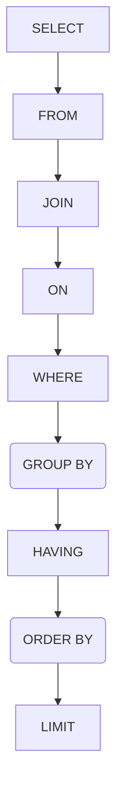

> **Ordem escrita da instrução SELECT**  
> Repositório: Banco de Dados MySQL - Fundamentos  
> GitHub: @michelelozada
&nbsp;
     
&nbsp;  
A instrução `SELECT` deve ser escrita com suas cláusulas obedecendo à seguinte ordem:

&nbsp;

**Observação:** É importante saber, porém, que a ordem acima **__não representa__** a ordem com que as consultas MySQL são, de fato, analisadas e processadas - o que é explicado detalhadamente [neste ótimo post aqui](https://towardsdatascience.com/the-6-steps-of-a-sql-select-statement-process-b3696a49a642).

&nbsp;

<a href="https://github.com/michelelozada/MySQL-Study-Notes">[Voltar à tela inicial do repositório]</a>

